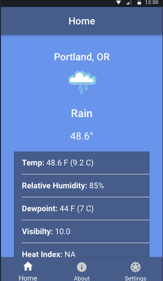
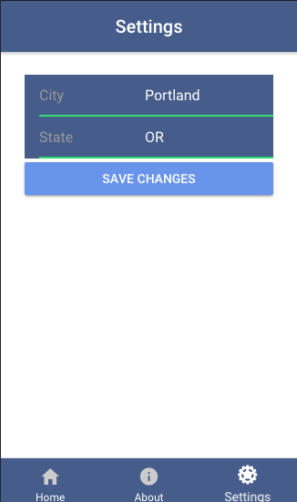

# _Ionic Weather App_
  <!-- 

    
  
 -->

_A simple weather app built with Ionic 3 that takes user input for city and state and displays various weather info. Built in a couple hours following a tutorial on YouTube because I wanted a quick Ionic/Angular refresher._

  

  

